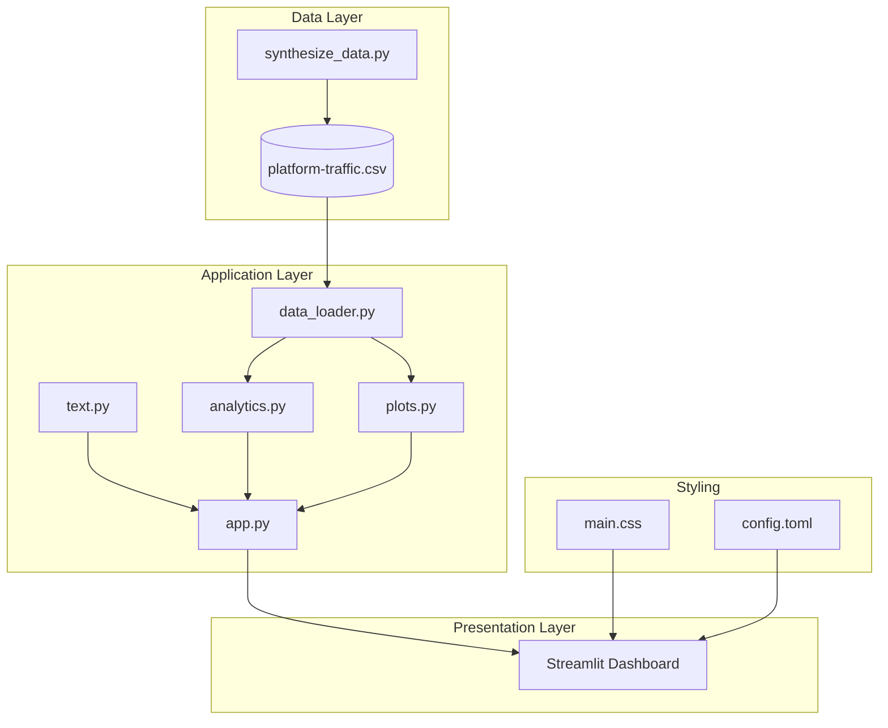

# Intelligence Flux Dashboard

[](https://your-app-url.streamlit.app/)
[](https://www.python.org/downloads/)
[](https://opensource.org/licenses/MIT)
[](https://github.com/astral-sh/ruff)

An advanced, interactive data analysis application built with Python and Streamlit. This dashboard provides deep
insights into web platform traffic, audience demographics, and performance engagement metrics.


## Features

- **Interactive Visualizations**: Powered by Plotly with zoom, hover, and dynamic filtering
- **Audience Segmentation**: Breakdown by geographical region and device type
- **Performance Analytics**: Real-time calculation of session duration and bounce rates
- **Time-Series Intelligence**: Advanced anomaly detection using statistical Z-scores
- **Premium UI**: High-fidelity aesthetic with soft rose/sky colour palette

## Architecture



## Project Structure

```
Forum-Page-Views-Analysis/
├── app.py                    # Main Streamlit application
├── assets/
│   ├── data/
│   │   └── platform-traffic.csv
│   └── images/
│       └── dashboard-preview.png
├── scripts/
│   └── synthesize_data.py    # Data generation script
├── styles/
│   └── main.css              # Custom styling
├── utils/
│   ├── __init__.py
│   ├── analytics.py          # KPI and anomaly detection
│   ├── data_loader.py        # Data loading and validation
│   ├── plots.py              # Plotly visualizations
│   └── text.py               # Dashboard content
├── tests/
│   └── test_analytics.py     # Unit tests
├── .streamlit/
│   └── config.toml           # Streamlit theme configuration
├── pyproject.toml            # Project configuration
├── requirements.txt          # Dependencies
└── README.md
```

## Requirements

### Software Requirements

- Python 3.10 or higher
- Streamlit >= 1.32.0
- Pandas >= 2.0.0
- Plotly >= 5.18.0
- NumPy >= 1.24.0
- SciPy >= 1.11.0

## Installation

1. Clone the repository:

   ```bash
   git clone https://github.com/elliottfairhall/Forum-Page-Views-Analysis.git
   cd Forum-Page-Views-Analysis
   ```

2. Create and activate a virtual environment:

   ```bash
   python -m venv venv
   source venv/bin/activate  # On Windows: venv\Scripts\activate
   ```

3. Install dependencies:

   ```bash
   pip install -r requirements.txt
   ```

4. (Optional) Install development dependencies:

   ```bash
   pip install -e ".[dev]"
   pre-commit install
   ```

## Running the Dashboard

1. (Optional) Regenerate synthetic data:

   ```bash
   python scripts/synthesize_data.py
   ```

   Or with custom date range:

   ```bash
   python scripts/synthesize_data.py --start-date 2020-01-01 --end-date 2025-12-31
   ```

2. Start the Streamlit application:

   ```bash
   streamlit run app.py
   ```

3. Open your browser at `http://localhost:8501`

## Dashboard Sections

| Tab                  | Description                                             |
| -------------------- | ------------------------------------------------------- |
| **Project Overview** | High-level project summary and methodology              |
| **Performance**      | High-level KPIs and longitudinal traffic trends         |
| **Global Reach**     | Geographical and device-based distributions             |
| **Engagement**       | Session duration and bounce rate over time              |
| **Intelligence**     | Statistical anomaly detection and distribution analysis |

## Key Metrics

- **Total Impressions**: Aggregate pageviews across all segments
- **Mean Daily Reach**: Average daily pageview count
- **Retention/Stay**: Average session duration in seconds
- **Bounce Index**: Proportion of single-page sessions

## Business Case

This tool provides actionable intelligence for digital platforms:

- Identify high-growth regions and device-specific trends
- Make data-driven decisions for infrastructure allocation
- Optimise marketing campaigns based on seasonal patterns
- Early warning system for tracking site health or viral events

## Development

### Running Tests

```bash
pytest tests/ -v
```

### Code Quality

```bash
# Lint and format
ruff check . --fix
ruff format .

# Type checking
mypy utils/
```

### Pre-commit Hooks

```bash
pre-commit run --all-files
```

## Contributing

1. Fork the repository
2. Create a feature branch (`git checkout -b feature/amazing-feature`)
3. Commit your changes (`git commit -m 'Add amazing feature'`)
4. Push to the branch (`git push origin feature/amazing-feature`)
5. Open a Pull Request

## License

This project is licensed under the MIT License - see the [LICENSE](LICENSE) file for details.

## Author

**Elliott Mayson-Sheridan**

- Website: [data-flakes.dev](https://data-flakes.dev)
- GitHub: [@elliottfairhall](https://github.com/elliottfairhall)
